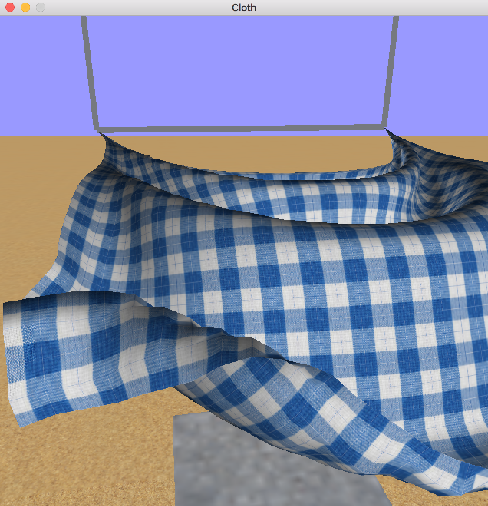

# ClothSimulator
A native OSX app that demonstrates real time cloth simulation using OpenGL and advanced algorithms.

## Algorithm

The alorithms used for the cloth simulation are based on the following paper

*David Baraff, and Andrew Witkin, "Large Steps in Cloth Simulation", Proc. of SIGGRAPH '98, pp. 43-54, 1998.* [www.cs.cmu.edu/~baraff/papers/sig98.pdf](http://www.cs.cmu.edu/~baraff/papers/sig98.pdf)

## Build

Open and build in XCode to produce the native Mac App. The base SDK is OSX 10.10/

